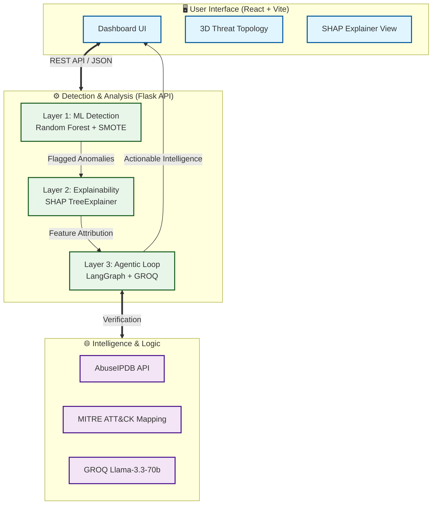

# Quick Start Guide

## System Requirements

- Python 3.11+
- Node.js 18+ (for React frontend)
- 4GB RAM minimum
- Trained ML models (see below)

---

## Step 1: Prepare ML Models

If you haven't trained the models yet:

```bash
cd /path/to/IS Project
source venv/bin/activate
python src/train.py
```

This creates:
- `models/rf_model.pkl` - Random Forest classifier
- `models/scaler.pkl` - Feature scaler

✅ **Status:** Models are trained and saved

---

## Step 2: Configure API Keys (Optional but Recommended)

Create `.env` file in project root:

```bash
# Required for threat classification
GROQ_API_KEY=gsk_your_key_here

# Required for IP reputation checks
ABUSEIPDB_API_KEY=your_key_here

# Optional: Toggle backend (system-level) voice assistant (true/false)
# If testing locally with the browser open, set to false to avoid echo
ENABLE_BACKEND_VOICE=false
```

**Without these keys:**
- GROQ: Falls back to heuristic threat classification
- AbuseIPDB: IP reputation checks disabled

Get keys from:
- 🔗 GROQ: https://console.groq.com/keys
- 🔗 AbuseIPDB: https://www.abuseipdb.com/register

---

## Step 3: Start Flask API Server

```bash
# Terminal 1: Flask API
cd /path/to/IS Project
source venv/bin/activate
python3 run_flask.py
```

Expected output:
```
================================================================================
AGENTIC IDS - FLASK API SERVER
================================================================================
2026-05-05 03:08:38 - src.app - INFO - ✓ SYSTEM INITIALIZED SUCCESSFULLY

🚀 Starting Flask server on http://0.0.0.0:5005
```

**API is now available at:** `http://localhost:5005`

---

## Step 4: Test Flask API (Optional)

In a new terminal:

```bash
cd /path/to/IS Project
source venv/bin/activate
```bash
cd /path/to/IS Project
source venv/bin/activate
pytest tests/test_flask_api.py
```

Expected output:
```
============================= test session starts ==============================
platform darwin -- Python 3.14.0, pytest-8.3.4, pluggy-1.5.0
rootdir: /path/to/IS Project
configfile: pytest.ini
collected 15 items

tests/test_flask_api.py ...............                                  [100%]

============================== 15 passed in 0.82s ==============================
✓ All tests passed! Flask API is properly secured and integrated.
```

---

## Step 5: Start React Frontend

```bash
# Terminal 2: React Frontend
cd /path/to/IS Project/frontend
npm install  # First time only
npm run dev
```

Expected output:
```
  VITE v8.0.10  ready in 123 ms

  ➜  Local:   http://localhost:5173/
  ➜  press h to show help
```

---

## Step 6: Access the Dashboard

Open your browser and navigate to:

```
http://localhost:5173
```

You should see the **Agentic IDS Dashboard** with:
- 🛡️ System status indicator
- 📊 SHAP feature analysis
- 🌍 3D threat topology map
## Dashboard Features

The React-based Security Operations Center (SOC) dashboard includes:
- 🌎 **3D Threat Globe**: Real-time geolocation of incoming attacks.
- ⚡ **Stress Test Simulator**: Trigger high-volume attack bursts to test system stability.
- 🔬 **Forensic Lab**: Live performance comparison (ML-IDS vs Snort vs Suricata).
- 🤖 **Agent Reasoning Logs**: Transparent view of the AI decision-making process.
- 💬 **Forensic Chat**: RAG-powered interface to query the system about specific threats.
- 🔊 **Voice Security Assistant**: Real-time audible threat alerts for hands-free SOC monitoring.

---

## Usage

### 1. Real-Time Monitoring & Packet Capture
The dashboard automatically polls the Flask API every 5 seconds. To capture real packets from your network interface, start the packet capture engine with elevated privileges (requires `sudo`):

```bash
# 1. Ensure Flask is running with sudo (required for network sniffing):
# sudo python run_flask.py

# 2. Trigger the live capture via the API:
curl -X POST http://localhost:5005/stream/start \
  -H "Content-Type: application/json" \
  -d '{"interface": "en0"}'
```
Captured packets will be processed by the Agentic API and appear on the 3D globe and in the threat feed.

### 2. Forensic Benchmarking
1. Navigate to the **Forensic Lab** tab.
2. View the performance metrics (Precision, Recall, F1-Score).
3. Compare the **Agentic IDS** against traditional rule-based systems (Snort/Suricata).

### 3. Stress Testing
1. Click the **STRESS TEST** button in the sidebar.
2. The button will pulse, and the system will simulate a burst of 10 rapid attacks.
3. Observe the 3D globe and threat feed for real-time handling of high-volume traffic.

### 4. Forensic Reasoning
1. Select any alert from the threat feed.
2. View the **Mathematical Evidence** (SHAP feature importance).
3. Switch to the **Agent Logs** tab to see the AI's step-by-step logic (Observe -> Hypothesize -> Verify -> Conclude).

### 5. Using the Voice Assistant
1. Locate the **Speaker Icon** in the top-right of the header.
2. Click to enable **Audible Alerts** (button will pulse blue).
3. When a high-risk threat (Risk > 7.0) is detected, the browser will announce the threat type and risk level.

### 5. Autonomous Red Teaming (Adversarial Battle)
The system includes a sophisticated multi-agent battle simulator to stress-test the IDS against adaptive AI attackers.
1. Ensure your `.env` has a valid `GROQ_API_KEY`.
2. Run the battle script:
   ```bash
   # Run 3 rounds of Attacker vs Defender
   python scripts/red_team_battle.py 3
   ```
3. Watch the terminal output as the **Attacker** generates payloads, the **Defender** (your IDS) tries to catch them, and the **Critic** provides feedback to the attacker.
4. Review the detailed session logs in the `logs/` directory.

### Load Malicious Signature
Click **MALICIOUS** button to load a pre-known attack pattern and analyze it.

### Stress Test
Click **STRESS TEST** to simulate 10 rapid threats for load testing.

## Architecture Diagram


---

## Cross-Dataset Evaluation

To verify the model's generalization (Addressing Instructor Critique #4):

1. **Place UNSW-NB15 dataset** in `data/UNSW_NB15.csv`.
2. **Run the evaluation script**:
   ```bash
   python scripts/run_evaluation.py
   ```
3. The `data_loader.py` will automatically apply the **Feature Translation Layer** to map UNSW features to the CICIDS model format.

---

## Troubleshooting

### Problem: "Models not loaded"
```bash
# Solution: Train models first
python src/train.py
```

### Problem: "GROQ_API_KEY not found"
```bash
# Models will fallback to heuristic threat detection
# No error, but less accurate LLM analysis
```

### Problem: React can't connect to Flask
- Check Flask is running on `http://localhost:5005`
- Check CORS headers are enabled (they are by default)
- Check firewall isn't blocking port 5005

### Problem: "Port 5005 already in use"
```bash
# Kill the process using port 5005
lsof -ti:5005 | xargs kill -9
```

### Problem: Slow response times
- First request ~2000ms (agent pipeline cold start)
- Subsequent requests ~500-1000ms
- This is expected due to GROQ API latency

---

## Development Commands

```bash
# Run tests
pytest tests/test_flask_api.py -v

# Check Flask app without starting server
python -c "from src.app import initialize_system; initialize_system()"

# View Flask routes
python -c "from src.app import app; print([r.rule for r in app.url_map.iter_rules()])"

# Clean up logs
rm -rf logs/*

# Rebuild models
python src/train.py --force
```

---

## Performance Optimization

### For Production:
1. Use Gunicorn instead of Flask dev server:
   ```bash
   pip install gunicorn
   gunicorn -w 4 -b 0.0.0.0:5005 "src.app:app"
   ```

2. Use environment variables for configuration
3. Implement request caching for identical flows
4. Use local Ollama for unlimited inference (no GROQ token limits)

### For Development:
Current setup is optimized for learning and debugging.

---

## Support

For issues or questions:

1. Check `logs/` for error messages
2. Review `docs/API.md` for endpoint details
3. Run `test_flask_api.py` to diagnose issues
4. Check if API keys are properly configured
