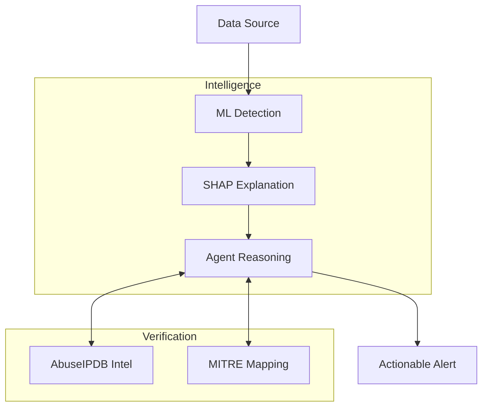

# 🛡️ SHAP-Explained Agentic IDS

### *Transforming Network Security with Explainable AI & Agentic Reasoning*


This project implements a **Hybrid Intrusion Detection System (IDS)** that bridges the gap between high-performance machine learning and human-readable security analysis. By combining **Random Forest** detection with **SHAP** (SHapley Additive exPlanations) and a **LangGraph-driven Agent**, the system doesn't just block threats—it explains *why* they were flagged.

---

## ⚡ TL;DR

**What it does:** Flags suspicious network flows using ML, then *explains why* using SHAP and checks IP reputation via AbuseIPDB.

**Example output:**
```
Flow 192.168.1.50 → 8.8.8.8:443 flagged as ANOMALY
ML Confidence: 0.92
Top features: Entropy=8.9 (+0.35), Dst_Port=443 (+0.20), Duration=3s (-0.05)
IP Reputation: 45/100 abuse score (suspicious)
MITRE ATT&CK: T1190 (Exploit Public-Facing Application)
Risk Score: 7.8/10 | Action: BLOCK
```

---

## 📋 System Requirements

- **Python 3.11+**
- **RAM:** 4GB minimum (8GB recommended for full CICIDS2017)
- **Disk:** 500MB free (for CICIDS2017 dataset ~300MB + models)
- **OS:** macOS, Linux, or WSL

---

## 🏗️ System Architecture



---

## 🚀 Key Features

*   **Explainable ML:** Uses SHAP to provide mathematical proof for every alert, showing exactly which network features (ports, duration, byte counts) triggered the detection.
*   **Agentic Verification:** A structured LangGraph agent uses **GROQ (Llama 3.3)** to verify alerts against external threat intelligence (AbuseIPDB) and map them to **MITRE ATT&CK** tactics.
*   **Academic Rigor:** Built with class-imbalance handling (SMOTE) and validated using cross-dataset evaluation (CICIDS2017 & UNSW-NB15).
*   **High-Density Dashboard:** A premium React-based Security Operations Center (SOC) dashboard for real-time monitoring and investigative deep-dives.

---

## 🛠️ Installation & Setup

### 1. Environment Setup
```bash
# Create and activate virtual environment
python3 -m venv venv
source venv/bin/activate

# Install dependencies
pip install -r requirements.txt
```

### 1.5 Verify Installation ✅
```bash
# Run quick tests to ensure everything is installed correctly
pytest tests/test_data_loader.py -v

# Expected output:
# ✓ test_cicids_data_exists PASSED
# ✓ test_cicids_feature_count PASSED
# ✓ All feature mappings valid
```

If tests fail, re-run: `pip install -r requirements.txt --upgrade`

### 2. Configuration
Create a `.env` file in the root directory:
```bash
GROQ_API_KEY=your_groq_api_key
ABUSEIPDB_API_KEY=your_abuseipdb_api_key
```

### 3. Training the Intelligence Pipeline
To train the detection model and initialize the explainability layer:
```bash
# Merges raw datasets and applies stratified sampling
python src/merge_data.py

# Trains the Random Forest + Scaler + SHAP Explainer
python src/train.py
```

---

## 📂 Documentation Stack

For detailed deep-dives into the project, refer to the following documents:

*   📄 **[Project Proposal](PROJECT_PROPOSAL_FINAL.md)**: High-level objectives and academic scope.
*   📚 **[Literature Review](LITERATURE_REVIEW.md)**: Analysis of the current IDS landscape.
*   📐 **[System Design](SYSTEM_DESIGN.md)**: Detailed architecture and technical constraints.
*   ⚡ **[Quick Start Guide](QUICK_START.md)**: Commands for running the server and dashboard.

---

## 📂 File Structure

```
IS Project/
├── src/                    # Core Production Logic
│   ├── app.py              # Clean Flask API Factory
│   ├── agent.py            # Agentic reasoning with Self-Correction
│   ├── schemas.py          # Strict Pydantic Data Validation
│   ├── services/           # Decoupled Business Logic
│   │   ├── inference.py    # ML & SHAP Execution
│   │   ├── geo_service.py  # Non-blocking IP Rep & Geolocation
│   │   └── persistence.py  # Thread-safe Alert Storage
│   ├── packet_capture.py   # Live Scapy-based sniffer
│   ├── streaming_api.py    # Real-time data pipeline
│   ├── train.py            # Model training & SMOTE balancing
│   ├── data_loader.py      # Data loading & Feature mapping
│   ├── config.py           # Central system configuration
│   └── merge_data.py       # Data cleaning pipeline
├── scripts/                # Helper & Experimental Scripts
│   ├── run_evaluation.py   # Cross-dataset evaluation
│   ├── dashboard.py        # Legacy Streamlit dashboard
│   ├── snort_comparison.py # Snort benchmark script
│   └── hybrid_ids_comparison.py
├── frontend/               # React + Vite SOC Dashboard (Premium UI)
├── models/                 # Serialized RF Models & Scalers
├── data/                   # CICIDS2017 & UNSW-NB15 datasets
├── tests/                  # Unit, Integration & Stress Tests
├── run_flask.py            # Main API Launcher (Root)
└── .env.example            # Environment template
```

---

## ⚖️ Status & Roadmap

**Phase 1-3: Complete ✅**
- [x] **Proposal:** Problem statement, objectives, timeline
- [x] **Literature Review:** 10+ sources, gap analysis, research justification
- [x] **System Design:** Architecture diagrams, threat model, evaluation plan

**Phase 4: Prototype (Due Week 9) 🔵**
- [x] Random Forest model training with SMOTE
- [x] SHAP explainability layer
- [x] Flask API `/detect` endpoint (Refactored Factory)
- [x] Test suite with 56 integration tests via pytest-mock
- [x] GitHub commits showing incremental progress

**Phase 5-7: Implementation (Weeks 10-15) ⏳**
- [x] Full end-to-end pipeline (data → model → SHAP → agent → API)
- [x] LangGraph agent with self-correcting conflict resolution
- [x] AbuseIPDB + MITRE ATT&CK integration
- [x] Cross-dataset evaluation (CICIDS2017 + UNSW-NB15)
- [x] React/Vite SOC dashboard (UI Polish)
- [x] Technical report + presentation

---

**Maintained by:** Muhammad Umar Farooq  
**Academic Context:** AI-374 Information Security (2026)
