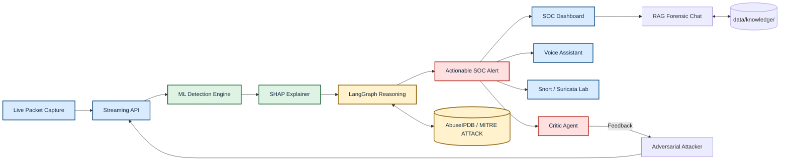

# 🛡️ SHAP-Explained Agentic IDS

### *Transforming Network Security with Explainable AI & Agentic Reasoning*


## 📖 Overview
This project implements a **Hybrid Intrusion Detection System (IDS)** designed for modern Security Operations Centers (SOC). It bridges the gap between high-performance "black-box" machine learning and actionable human-readable security analysis. 

The system leverages **Random Forest** classification for high-speed detection, **SHAP** (SHapley Additive exPlanations) for transparency, and a **LangGraph-driven Agent** for intelligent verification and contextualization. Unlike traditional systems that only flag threats, this platform explains *why* a flow was flagged and provides remediation steps based on live threat intelligence.

**New in v2.5:** Integrated **Autonomous Red Teaming Framework** where AI agents (Attacker & Critic) continuously stress-test the Defender to find and fix "stealthy" bypass vulnerabilities.

---

## 🏗️ System Architecture

The core logic follows a non-linear reasoning pipeline implemented with **LangGraph**:


```mermaid
flowchart LR
    Capture[Live Packet Capture] --> Stream[Streaming API]
    RedTeam[Adversarial Attacker] --> Stream

    Stream --> Detect[ML Detection Engine]
    Detect --> Explain[SHAP Explainer]
    Explain --> Reason[LangGraph Reasoning]
    Reason --> Alert[Actionable SOC Alert]

    Reason <--> Intel[(AbuseIPDB / MITRE ATTACK)]
    Alert --> Dashboard[SOC Dashboard]
    Dashboard --> Chat[RAG Forensic Chat]
    Alert --> Voice[Voice Assistant]
    Alert --> Lab[Snort / Suricata Lab]
    Chat <--> KB[(data/knowledge/)]
    Critic[Critic Agent] -->|Feedback| RedTeam
    Alert --> Critic

    style Capture fill:#d9ecff,stroke:#0f4c81,stroke-width:2px,color:#102a43
    style Stream fill:#d9ecff,stroke:#0f4c81,stroke-width:2px,color:#102a43
    style Detect fill:#dff3e4,stroke:#1f6b3a,stroke-width:2px,color:#102a43
    style Explain fill:#dff3e4,stroke:#1f6b3a,stroke-width:2px,color:#102a43
    style Reason fill:#fff2cc,stroke:#8a5b00,stroke-width:2px,color:#102a43
    style Alert fill:#ffe0e0,stroke:#b42318,stroke-width:2px,color:#102a43
    style Dashboard fill:#d9ecff,stroke:#0f4c81,stroke-width:2px,color:#102a43
    style Voice fill:#d9ecff,stroke:#0f4c81,stroke-width:2px,color:#102a43
    style Lab fill:#d9ecff,stroke:#0f4c81,stroke-width:2px,color:#102a43
    style Critic fill:#ffe0e0,stroke:#b42318,stroke-width:2px,color:#102a43
    style Intel fill:#fff2cc,stroke:#8a5b00,stroke-width:2px,color:#102a43
```

For a more detailed, text-first breakdown of the architecture, see [docs/SYSTEM_ARCHITECTURE.md](docs/SYSTEM_ARCHITECTURE.md).

---

## 🚀 Key Features

*   **Explainable ML (XAI):** Integrated SHAP layer provides mathematical proof for every alert, mapping raw network features (entropy, ports, durations) to contribution scores.
*   **Agentic Self-Correction:** A LangGraph reasoning engine uses **Llama 3.3 (via Groq)** to verify ML outputs against live reputation data and resolves conflicts between model predictions and network logic.
*   **Autonomous Red Teaming:** A multi-agent adversarial framework where an **Attacker** generates payloads and a **Critic** analyzes defense logs to teach the attacker how to bypass the IDS, creating a continuous hardening loop.
*   **Live Threat Intelligence:** Automated IP reputation checks via **AbuseIPDB** and automated mapping to **MITRE ATT&CK** tactics and techniques.
*   **Real Packet Capture & Streaming API:** Native Scapy-based sniffer (`packet_capture.py`) for live interface capture, coupled with a highly concurrent REST Streaming API (`streaming_api.py`) for continuous line-rate packet analysis.
*   **Real Snort/Suricata Comparison:** Integrated side-by-side behavioral forensic lab (`snort_comparison.py`) to benchmark the LLM Agent against traditional signature-based rules (addresses Tier S requirement).
*   **Baseline Classifier & Efficiency Benchmarking:** `scripts/run_evaluation.py` compares Logistic Regression, GaussianNB, MultinomialNB, ComplementNB, Decision Tree, Random Forest, and optional XGBoost using Accuracy, Precision, Recall, F1, ROC-AUC, training time, inference latency, peak training memory, serialized model size, and per-attack-class metrics.
*   **Forensic Lab Reporting:** The React Forensic Lab displays Snort/Suricata comparison, model baseline leaderboards, efficiency tradeoffs, and per-attack-class Random Forest diagnostics from the generated benchmark report.
*   **Real-time SOC Dashboard:** A premium React-based interface featuring a 3D threat globe, RAG-powered forensic chat, and high-density telemetry.
*   **Voice-Driven Security Assistant:** Integrated audible alert system using both backend (macOS `say`) and frontend (Web Speech API) synthesis to provide hands-free threat reporting for SOC analysts.
*   **Empirical Cross-Dataset Validation:** System performance is rigorously tested across heterogeneous datasets (CICIDS2017 & UNSW-NB15) to ensure model generalization and robustness against novel attack patterns.

---

## 🛠️ Installation & Setup

### 1. Requirements
- **Python 3.11+**
- **Node.js 18+** (for frontend)
- **API Keys:** Groq (for LLM) and AbuseIPDB (for threat intel)

### 2. Backend Setup
```bash
# Create and activate virtual environment
python3 -m venv venv
source venv/bin/activate

# Install dependencies
pip install -r requirements.txt

# Configure environment
cp .env.example .env
# Edit .env with your GROQ_API_KEY and ABUSEIPDB_API_KEY
# Development defaults: INTERNAL_API_KEY and FRONTEND_ORIGIN are pre-filled in .env.example
```

### Frontend environment
```bash
cd frontend
cp .env.example .env.local
# VITE_API_URL only — API key is entered in the dashboard unlock screen (not stored in the frontend bundle)
```

### 3. Frontend Setup
```bash
cd frontend
npm install
```

---

## 🚦 Usage Guide

### 1. Data Preparation & Training
Before running the system, initialize the ML pipeline:
```bash
# Merge raw datasets (CICIDS2017)
python src/merge_data.py

# Train the Random Forest + SHAP Explainer
python src/train.py
```

### 2. Launching the System
```bash
# Start the Flask Backend for local development (default port 5005)
python run_flask.py

# Production (Gunicorn + WSGI)
# gunicorn -c gunicorn.conf.py

# Start the React Dashboard (in a separate terminal)
cd frontend
npm run dev
```

### 3. Running Benchmarks
To generate the empirical data for the Forensic Lab:
```bash
python scripts/run_evaluation.py
```
This writes the baseline/efficiency comparison to `docs/BASELINE_EFFICIENCY_COMPARISON.md` and `docs/baseline_efficiency_results.json`.

For generating updated slides, see `docs/NOTEBOOKLM_SLIDE_SOURCES.md`.

### 4. Autonomous Red Teaming (Adversarial Battle)
To run the multi-agent battle (Attacker vs Defender):
```bash
# Run a 3-round battle to stress-test the IDS
python scripts/red_team_battle.py 3
```

---

## 🌐 Deployment

This system is **95% deployable on free cloud platforms** with only API rate-limit constraints.

### Quick Deploy (5 minutes)
1. **Backend:** Deploy to [Render.com](https://render.com) (free tier, unlimited projects)
2. **Frontend:** Deploy to [Vercel](https://vercel.com) (free tier)
3. **APIs:** Use free tiers of GROQ (100K tokens/day) + AbuseIPDB (1000 requests/day)
4. **Cost:** $0/month for small volumes

For detailed deployment instructions, see [**DEPLOYMENT.md**](DEPLOYMENT.md). It contains focused, up-to-date steps for deploying the backend to Render and the frontend to Vercel, plus environment variable and model guidance.

---

## 📂 Project Structure

```text
IS Project/
├── src/                    # Core Backend Logic
│   ├── agent.py            # LangGraph Reasoning Engine for Threat Verification
│   ├── attacker.py         # Adversarial Agent for Red Teaming (New)
│   ├── critic.py           # Analysis Agent for Adversarial Feedback (New)
│   ├── app.py              # Flask API Application & REST Endpoints
│   ├── config.py           # Central System Settings & Environment Variables
│   ├── data_loader.py      # Feature Translation & Dataset Parsing
│   ├── evaluation_metrics.py# Model Accuracy and Testing Metrics Helper
│   ├── merge_data.py       # Utility for Merging CICIDS CSV Distributions
│   ├── packet_capture.py   # Live Scapy-based Network Sniffer & PCAP Extractor
│   ├── schemas.py          # Pydantic Schemas for Strict Data Validation
│   ├── snort_comparison.py # Real Snort/Suricata Rule Benchmarking Engine
│   ├── streaming_api.py    # Async Streaming API for Continuous Network Detection
│   ├── train.py            # Random Forest ML Training & SMOTE Pipeline
│   └── services/           # Decoupled Business Logic / Abstraction Layer
│       ├── geo_service.py  # Map IPs to Geolocation via APIs
│       ├── inference.py    # SHAP TreeExplainer & RF ML Prediction Engine
│       ├── persistence.py  # JSON Alert Logging & Data Persistence
│       ├── rag_service.py  # TF-IDF RAG retrieval for forensic chat
│       ├── red_team_service.py # Red team battle orchestration
│       └── voice_service.py # Audible Security Alert System
├── frontend/               # React + Vite SOC Dashboard Website
│   ├── src/                # Frontend Application Code
│   │   ├── components/     # Reusable React UI (Dashboard, ChatWidget w/ RAG sources, …)
│   │   ├── utils/          # API Communication Handlers
│   │   ├── ThreatGlobe.jsx # 3D Three.js Live Attack Geolocation Map
│   │   ├── Analytics.jsx   # Reporting, Visualizations & Metrics Dashboard
│   │   └── App.jsx         # Main React App Core & Routing
│   └── package.json        # Frontend deps (`npm run test` — Vitest + Testing Library)
├── scripts/                # Research, Utilities & Report Scripts
│   ├── run_evaluation.py   # Cross-Dataset Baseline + Efficiency Benchmarking
│   └── red_team_battle.py  # Autonomous Adversarial Loop Engine (New)
├── tests/                  # Pytest Unit & Integration Testing Suite
│   ├── test_flask_api.py   # System API Endpoint Checks
│   ├── test_agent_steps.py # Tests for LangGraph Node Functionalities
│   └── test_integration_e2e.py # End-to-End full system logic tests
│   └── test_rag_service.py     # TF-IDF knowledge retrieval unit tests
├── data/                   # Datasets (CICIDS2017 & UNSW-NB15)
│   └── knowledge/          # RAG markdown playbooks (MITRE, benchmarks, threat patterns)
├── models/                 # Serialized models (`rf_model.pkl`, `scaler.pkl`, `model_metadata.json`)
├── wsgi.py                 # Production WSGI entry (`gunicorn -c gunicorn.conf.py`)
├── gunicorn.conf.py        # Gunicorn bind/workers configuration
├── docs/                   # Full Technical Reporting & Academic Documentation
│   ├── API.md              # REST API Interface Spec Details
│   ├── SYSTEM_ARCHITECTURE.md # Architecture Blueprints
│   └── FINAL_COMPREHENSIVE_REPORT.md # Academic Grading Project Report
├── logs/                   # System Threat & Error Runtime Logging Outputs
├── QUICK_START.md          # Easy Step-by-Step Setup Guide
├── run_flask.py            # Core Entry Point script to boot backend application
└── requirements.txt        # Python Backend Dependencies File
```

---

## 🛡️ Security & Hardening
- **API Security:** Privileged routes accept a valid `X-API-KEY` header (`INTERNAL_API_KEY`, 32+ chars in production), an authenticated Flask session, or the signed browser session token returned by `POST /api/v1/auth/login`. The React dashboard unlocks without shipping the API key in the frontend bundle.
- **Runtime validation:** `ENVIRONMENT=production` enforces `INTERNAL_API_KEY`, `FRONTEND_ORIGIN`, and related checks at startup (`validate_runtime_config()`).
- **Rate Limiting:** Enforced via `Flask-Limiter` to prevent DoS attacks on the LLM reasoning engine.
- **Graceful Degradation:** Adaptive dynamic queue-depth load shedding (e.g. `>2000` dropped to Layer 1 fast-path) safely maintains throughput and acts as an anti-flood safeguard when the system is under intense volumetric DDoS attacks. 
- **Defense Against Explanation Manipulation:** Cross-Signal Verification (CSV) cross-checks SHAP values against external immutable networking logics, offering an inherent mechanism to counter adversarial machine learning explainability exploits.
- **Input Validation:** Strict Pydantic schemas enforce type-safety and feature range validation.
- **CORS Protection:** Origin-locked configuration to prevent unauthorized cross-site requests.

---

## 🛑 Limitations & Future Work
- **Out-of-Scope Attacks (No Deep Packet Inspection):** As the pipeline strictly uses 12-feature flow statistics, deeply embedded payload-level exploits (e.g., zero-day remote code executions, encrypted application-layer malware, SQLi payloads) are out-of-scope. **Future Integration:** Deep Packet Inspection (DPI) coupled with multimodal LLM capabilities will analyze text-based payload payloads directly to catch obfuscated application-layer attacks.

---

**Developed by:** Muhammad Umar Farooq  
**License:** MIT
