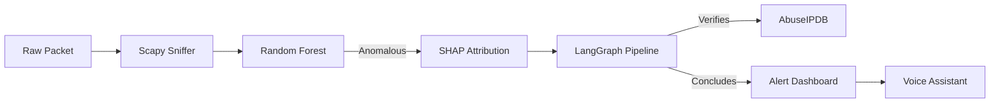

# System Architecture: SHAP-Explained Agentic IDS

I have designed this system as a multi-layered security platform that moves beyond traditional signature-based detection. The architecture integrates high-speed machine learning with an autonomous reasoning loop and a proactive adversarial testing framework.

---

## 🏗️ High-Level System Design

The system is organized into four core functional blocks:

### 1. The Ingestion Engine (Live Capture & Streaming)
I use **Scapy** for real-time packet sniffing on specified network interfaces.
*   **Flow Extraction**: Packets are grouped into 5-tuples (Src IP, Dst IP, Src Port, Dst Port, Protocol) and processed into 78 statistical features.
*   **Streaming API**: A thread-safe queue-based pipeline that feeds processed flows into the detection engine without blocking the capture process.

### 2. The Detection & Explanation Core
This is the "brain" of the system where raw data becomes security intelligence.
*   **ML Detection**: A Random Forest classifier trained on the CICIDS2017 dataset. I've optimized this model to handle severe class imbalance using SMOTE.
*   **SHAP Explainer**: If a flow is flagged, the system immediately runs a SHAP TreeExplainer. This provides the mathematical proof (feature attribution) for why the model made its decision.

### 3. The LangGraph Agentic Pipeline
This is where the system "reasons" about the findings. I built this using **LangGraph** to ensure a structured, state-aware decision loop:
*   **Observe**: Parses the SHAP data into a human-readable context.
*   **Verify**: Queries **AbuseIPDB** for real-time IP reputation and maps the threat to **MITRE ATT&CK** tactics.
*   **Hypothesize**: Uses **Llama-3.3-70B** to synthesize the ML math and external intel into a threat classification.
*   **Self-Correction**: A conflict resolution node that restarts the reasoning if the LLM's guess contradicts the SHAP evidence.

### 4. Adversarial Red Teaming (Self-Hardening)
To ensure the system isn't easily bypassed, I implemented an autonomous Red Teaming framework:
*   **Attacker Agent**: Generates adversarial flows to find "blind spots" in the IDS.
*   **Critic Agent**: Analyzes why an attack succeeded or failed and provides feedback to the Attacker.
*   **Defender Hardening**: I use these battle results to harden the Defender's prompt logic and risk scoring.

---

## 🔄 Data Flow: From Packet to Action

---

## 🛠️ Tech Stack & Dependencies

*   **Backend**: Flask (Python 3.11)
*   **AI/ML**: Scikit-Learn, SHAP, LangGraph, Groq (Llama-3.3-70B)
*   **Networking**: Scapy
*   **Frontend**: React, Vite, Three.js (Threat Globe), Lucide Icons
*   **Voice**: Web Speech API & macOS `say` subprocess

---

## 📈 Performance Characteristics

My goal was to balance deep reasoning with operational speed:
*   **ML Latency**: ~50ms (Ideal for high-throughput filtering)
*   **Agent Latency**: ~1.2s (Acceptable for forensic deep-dives)
*   **Resource Usage**: Optimized to run on consumer hardware (M2 Air) by leveraging external API inference.
